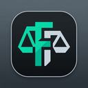

<div align="center">
  
  <h1>finnca</h1>
  <p>pencatatan keuangan double-entry yang serius, tapi tidak ribet</p>

[](LICENSE)
[](https://github.com/endrico-fn/finnca/releases)
[](https://github.com/endrico-fn/finnca/releases)
[](https://github.com/endrico-fn/finnca)
</div>

---

# finnca

aplikasi personal finance note, double-entry

## Fitur yang ada

- **Dashboard** — overview saldo, arus kas, dan transaksi terkini
- **Chart of Accounts** — bagan akun bertingkat, navigasi-nya pakai path bukan tree: `Aset > Bank > BCA`
- **Journal** — entri jurnal dengan filter, pencarian, status rekonsiliasi
- **Reports** — laba rugi, neraca, neraca saldo, tren, cashflow, revaluasi FX, simulator pelunasan hutang
- **Plan & Calendar** — hutang, piutang, cicilan — semua ada kalender jatuh temponya
- **Budget** — sistem envelope: tiap rupiah ada tugasnya
- **Reconcile** — cocokkan catatan dengan mutasi bank lewat impor CSV
- **Multi-vault** — beberapa vault terpisah, seperti mekanisme vault di Obsidian
- **Multi-currency** — IDR dan USD, lengkap dengan kurs dan laporan revaluasi

## Privacy

Semua data tersimpan lokal dan terenkripsi. Kamu bikin vault sendiri, tentukan sendiri di mana foldernya disimpan, pakai password sendiri. Vault-nya terisolasi dalam satu folder — gampang di-backup, gampang dipindah

## Install

### Linux (Ubuntu/Debian)

```bash
sudo apt install ./finnca_*.deb
```

### Linux (Fedora/openSUSE)

```bash
sudo dnf install ./finnca_*.rpm
```

### Linux (portable / distro apapun)

```bash
curl -fsSL https://raw.githubusercontent.com/endrico-fn/finnca/main/scripts/install.sh | bash
```

Atau download `.AppImage` langsung dari [Releases](https://github.com/endrico-fn/finnca/releases), kasih permission execute, jalankan.

### Windows

Download `.msi` atau `_x64-setup.exe` dari [Releases](https://github.com/endrico-fn/finnca/releases), klik install.

---

### Uninstall (jika install via script)

```bash
curl -fsSL https://raw.githubusercontent.com/endrico-fn/finnca/main/scripts/uninstall.sh | bash
```

### Upgrade (jika install via script)

```bash
curl -fsSL https://raw.githubusercontent.com/endrico-fn/finnca/main/scripts/upgrade.sh | bash
```

## Jalankan dari source

Butuh [Node.js](https://nodejs.org), [pnpm](https://pnpm.io), dan [Rust](https://rustup.rs).

```bash
git clone https://github.com/endrico-fn/finnca.git
cd finnca
pnpm install
pnpm tauri dev
```

Build installer:

```bash
pnpm tauri build
```

Output ada di `src-tauri/target/release/bundle/`.

## Stack

| Layer      | Tech                                                                |
| ---------- | ------------------------------------------------------------------- |
| Frontend   | SvelteKit 5, Tailwind CSS v4, TypeScript                            |
| Backend    | Rust, Tauri 2                                                       |
| Database   | SQLite + SQLCipher (enkripsi AES-256)                               |
| KDF        | Argon2id (envelope encryption)                                      |
| Arithmetic | integer minor-units `i128` — bukan float, tidak ada selisih Rp 0,01 |

## Status

Proyek pribadi yang aktif dikembangkan. Kalau kamu nemuin ini dan mau pakai — silakan. Kalau ada yang aneh, buka issue.

## License

MIT
