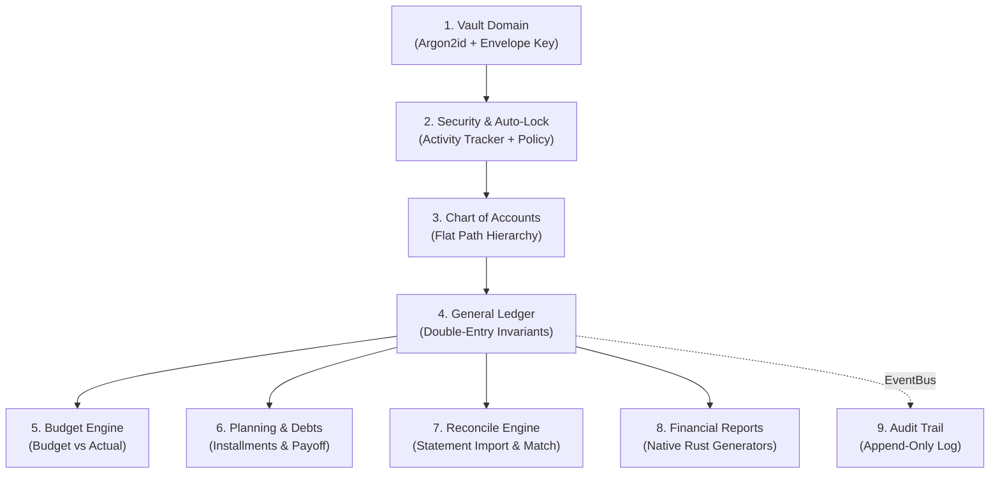

# 🗺️ Finnca Domain Catalog & Architecture Boundaries

Katalog peta domain aplikasi Finnca, mencakup tanggung jawab domain, batas boundary (_subsystem boundaries_), dan kontrak IPC antara frontend Svelte dan backend Rust.

---

## 1. Peta Domain & Tanggung Jawab

---

## 2. Rincian Domain

### 1. Vault Management (`src-tauri/src/vault/`)

- **Tanggung Jawab:** Pembuatan, pendaftaran, pembukaan (_unlock_), pergantian (_switch_), penghapusan (_delete with password_), dan migrasi vault.
- **Pola Penyimpanan:** Direktori independen `finnca-<nama_vault>/`.
- **Database Encrypted:** Setiap vault memiliki basis data terisolasi `vault.db` yang dienkripsi SQLCipher.

### 2. Security & Auto-Lock (`src-tauri/src/security/`)

- **Tanggung Jawab:** Memantau inaktivitas pengguna (_user idle time_) dan mengeksekusi penguncian otomatis (_auto-lock timeout_).
- **Kebijakan:** `OnClose`, `OnReboot`, atau `OnTimeout(duration)`.
- **Komunikasi:** Mengirimkan sinyal reactive melalui event Tauri ke `src/lib/core/state/security.svelte.ts`.

### 3. Chart of Accounts (`src-tauri/src/accounts/`)

- **Tanggung Jawab:** CRUD struktur akun finansial.
- **Karakteristik Unik Finnca:** Akun **tidak** dirender sebagai _nested tree_ yang dalam, melainkan sebagai **Path Akun Datar**:
  $$\text{RootAccount} > \text{SubAccount} > \text{Account}$$
  Contoh: `Assets > Current Assets > BCA Checking`.
- **Tipe Akun Dasar:** `Asset`, `Liability`, `Equity`, `Income`, `Expense`.

### 4. General Ledger (`src-tauri/src/ledger/`)

- **Tanggung Jawab:** Pencatatan entri jurnal double-entry, validasi pembukuan berimbang ($\sum \text{Debit} = \sum \text{Kredit}$), dan kalkulasi saldo buku besar.
- **Aritmatika:** `i128` integer minor units (sen/rupiah dasar) tanpa floating-point drift.
- **Multi-Currency:** Menyimpan nilai asli (_original currency_) dan nilai buku dasar (_base currency_), serta snapshot nilai tukar (_exchange rate_).

### 5. Budgeting (`src-tauri/src/budget/`)

- **Tanggung Jawab:** Penetapan alokasi anggaran per kategori akun pengeluaran per periode bulanan, serta komparasi _Budget vs Actual_.

### 6. Planning & Debt Management (`src-tauri/src/plan/`)

- **Tanggung Jawab:** Manajemen rencana tabungan, simulasi pelunasan utang, dan pelacakan pembayaran cicilan berulang.

### 7. Reconcile Engine (`src-tauri/src/reconcile/`)

- **Tanggung Jawab:** Pembacaan berkas rekening koran eksternal (CSV/OFX/QIF), pencocokan transaksi otomatis berbasis aturan (_rule-based matcher_), dan pembaruan status rekonsiliasi akun (`cleared` / `reconciled`).
- **Security Sandboxing:** Menggunakan Rust command `read_statement_file_cmd` yang terotentikasi session dan dibatasi kuota 5 MB.

### 8. Financial Reports (`src-tauri/src/report/`)

- **Tanggung Jawab:** Generator laporan keuangan instan yang di-query langsung dari SQLite di sisi Rust:
  - _Balance Sheet_ (Neraca)
  - _Profit & Loss_ (Laba Rugi)
  - _Cash Flow Statement_ (Arus Kas Langsung & Tidak Langsung)
  - _Trial Balance_ (Neraca Saldo)
  - _Historical Trends & Metrics_
  - _FX Revaluation_ (Laba/Rugi Selisih Kurs Belum Terealisasi)

### 9. Audit Trail (`src-tauri/src/audit/`)

- **Tanggung Jawab:** Log audit append-only yang merekam setiap peristiwa mutasi finansial, pergantian password, atau perubahan konfigurasi sistem.
- **Decoupled:** Terhubung melalui internal event bus (`shared/events.rs`), sehingga modul Ledger tidak memiliki ketergantungan langsung terhadap modul Audit.
